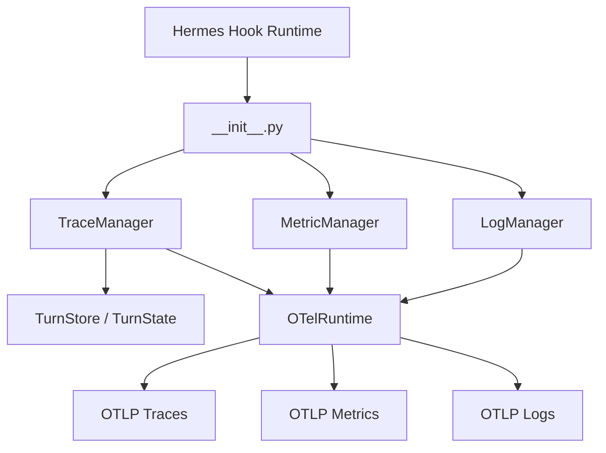
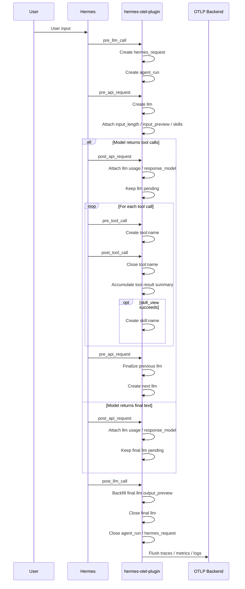
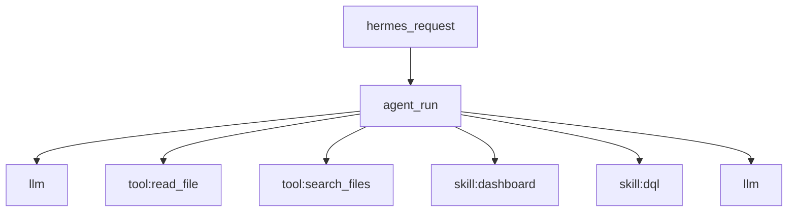
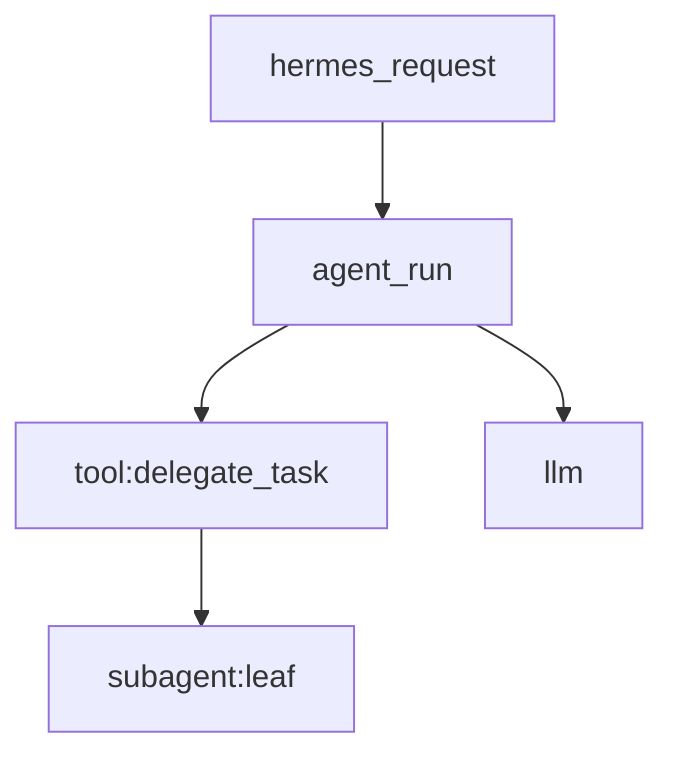

# Architecture Diagram

This document explains the runtime architecture of `hermes-otel-plugin`, the mapping from Hermes hooks to spans, and the lifecycle of `skill`, `subagent`, `llm`, and `tool`.

## Overall Structure

## Hook Mapping

```mermaid
flowchart TD
    A[pre_llm_call] --> A1[Create hermes_request]
    A --> A2[Create agent_run]

    B[pre_api_request] --> B1[Create llm]
    C[post_api_request] --> C1[Attach usage / finish_reason / response_model]
    C --> C2[Keep llm pending until output shape is known]

    D[pre_tool_call] --> D1[Create tool:name]
    E[post_tool_call] --> E1[Close tool:name]
    E --> E2[Attach tool_result_status / tool_result_preview]
    E --> E3[Emit skill:name when needed]

    F[subagent_stop] --> F1[Create subagent:role]

    G[post_llm_call] --> G1[Close final llm]
    G --> G2[Close agent_run]
    G --> G3[Close hermes_request]

    H[on_session_end / finalize / reset] --> H1[Fallback cleanup for orphan spans]
```

## Request Timeline

## Span Hierarchy

Normal request hierarchy:

With a delegated subagent:

## LLM Span Rules

- The `llm` span is created in `pre_api_request`.
- `post_api_request` only attaches usage, finish reason, and response model. It does not immediately assume the final output shape.
- If tool calls happen afterwards, that `llm` is marked with `output_kind=tool_call` and `output_preview=toolCall:name1,name2`.
- If that `llm` produces the final answer, `output_preview` is backfilled during `post_llm_call`.
- `input_preview` uses the turn user input for the first `llm`, and a synthesized summary of tool results since the previous model call for later `llm` spans.

## Skill Span Rules

- `tool:skill_view` represents the skill load action and load duration.
- `skill:name` represents the effective execution window of a skill during the current request.
- Multiple `skill:name` spans may stay active at the same time, so overlap is expected.
- Related `llm` spans carry:
  - `skills`
  - `skill_count`

## Token Accounting Rules

- `usage_total_tokens = usage_input_tokens + usage_output_tokens`
- Cache tokens are not included in `usage_total_tokens`.
- Cache tokens are recorded separately:
  - `usage_cache_read_input_tokens`
  - `usage_cache_write_input_tokens`
  - `usage_cache_total_tokens`
- If the provider returns cumulative cache counters, the plugin normalizes them into per-call deltas.
- `usage_reasoning_tokens` is only forwarded when Hermes or the provider already exposes it; the plugin does not infer it.

## Error Handling and Fallbacks

- LLM failures are marked as `ERROR` in `post_api_request` based on `finish_reason`.
- Tool failures are marked as `ERROR` in `post_tool_call` based on result status.
- Spans that do not close normally:
  - are closed at turn end as `orphaned_request` / `orphaned_tool`
  - are cleaned up again during session finalize/reset
