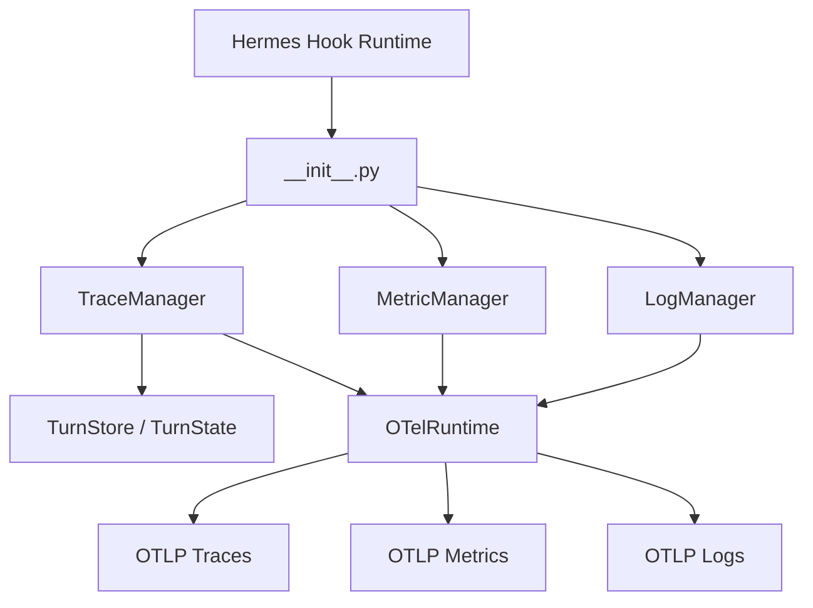
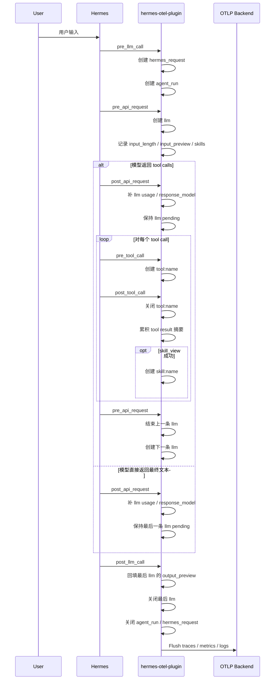
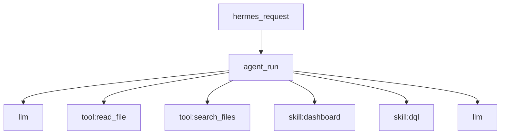
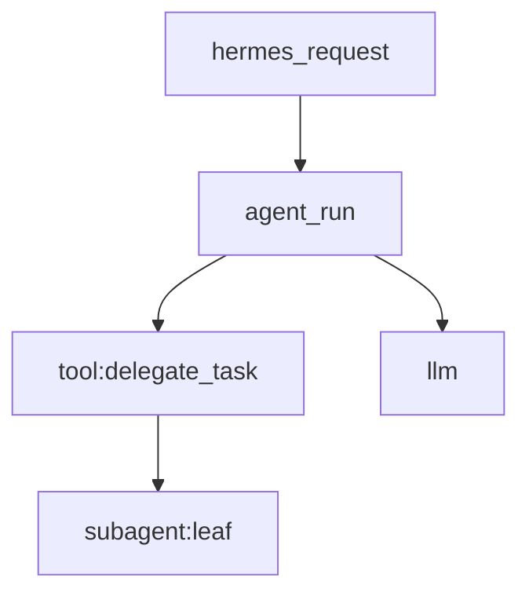

# 架构图

[English Version](../en/architecture.md)

本文档说明 `hermes-otel-plugin` 的运行时架构、Hermes hooks 到 spans 的映射关系，以及 `skill`、`subagent`、`llm`、`tool` 的生命周期。

## 总体结构

## Hook 映射

```mermaid
flowchart TD
    A[pre_llm_call] --> A1[创建 hermes_request]
    A --> A2[创建 agent_run]

    B[pre_api_request] --> B1[创建 llm]
    C[post_api_request] --> C1[补 usage / finish_reason / response_model]
    C --> C2[在确认输出形态前暂存 llm]

    D[pre_tool_call] --> D1[创建 tool:name]
    E[post_tool_call] --> E1[关闭 tool:name]
    E --> E2[补 tool_result_status / tool_result_preview]
    E --> E3[必要时生成 skill:name]

    F[subagent_stop] --> F1[创建 subagent:role]

    G[post_llm_call] --> G1[关闭最后一个 llm]
    G --> G2[关闭 agent_run]
    G --> G3[关闭 hermes_request]

    H[on_session_end / finalize / reset] --> H1[兜底清理 orphan spans]
```

## 请求时序

## Span 层级

普通请求层级：

包含子代理委托时：

## LLM Span 规则

- `llm` span 在 `pre_api_request` 创建。
- `post_api_request` 只补 usage、finish reason 和 response model，不会立刻假设最终输出形态。
- 如果后续发生 tool calls，该 `llm` 会标记为 `output_kind=tool_call`，并写入 `output_preview=toolCall:name1,name2`。
- 如果该 `llm` 产出最终回答，则在 `post_llm_call` 回填 `output_preview`。
- 首个 `llm` 的 `input_preview` 使用 turn 的用户输入；后续 `llm` 使用上一次模型调用之后的工具结果摘要。

## Skill Span 规则

- `tool:skill_view` 表示 skill 的加载动作和加载耗时。
- `skill:name` 表示该 skill 在当前请求中的生效执行窗口。
- 多个 `skill:name` 同时活跃是正常现象，因此 span 重叠是预期行为。
- 相关 `llm` span 会带：
  - `skills`
  - `skill_count`

## Token 统计规则

- `usage_total_tokens = usage_input_tokens + usage_output_tokens`
- cache token 不计入 `usage_total_tokens`
- cache token 单独记录为：
  - `usage_cache_read_input_tokens`
  - `usage_cache_write_input_tokens`
  - `usage_cache_total_tokens`
- 如果 provider 返回累计 cache 计数，插件会把它归一成单次调用的增量。
- `usage_reasoning_tokens` 只在 Hermes 或 provider 已透传时转发，插件不会自行推断。

## 错误处理与兜底

- LLM 失败会在 `post_api_request` 根据 `finish_reason` 标记为 `ERROR`。
- Tool 失败会在 `post_tool_call` 根据结果状态标记为 `ERROR`。
- 没有正常关闭的 spans：
  - 会在 turn 结束时以 `orphaned_request` / `orphaned_tool` 收口
  - 也会在 session finalize/reset 时再次兜底清理
